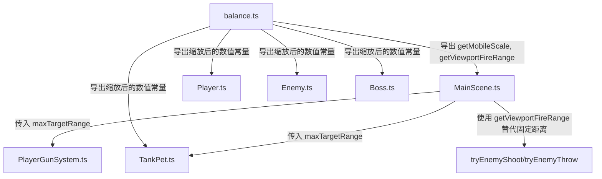

## 用户需求

对 GrassCutter 游戏进行移动端体验优化，核心问题是当前所有实体（玩家、敌人、Boss、武器、坦克宠物）在手机屏幕上占比过大，移动速度过快，且屏幕外的敌人已经可以攻击玩家。

## 产品概述

针对手机屏幕（约 375x812）进行全局尺寸和数值的等比缩放优化，确保游戏在移动端呈现合理的视觉比例和操控手感。同时将敌人攻击和玩家自动射击限制在屏幕可视范围内，避免"屏幕外互殴"的不合理体验。

## 核心功能

1. **移动端检测与全局缩放系数**：根据屏幕宽度自动判断是否为移动端，移动端下所有实体尺寸乘以缩放系数（约 0.6-0.65），桌面端保持不变
2. **实体大小缩小**：玩家 radius 30→约 18、敌人 radius 25→约 15、Boss radius 50→约 30；武器贴图、坦克宠物车身/炮管等比缩小
3. **移动速度降低**：玩家速度和敌人速度在移动端等比降低，避免在小屏幕上移动过快
4. **敌人攻击限制在屏幕可视范围**：将射击怪和投掷怪的攻击距离阈值从固定 520px 改为基于摄像机视口的动态计算，只有在屏幕可见范围内的敌人才能攻击
5. **玩家自动射击限制在屏幕可视范围**：PlayerGunSystem 索敌时增加视口距离限制，不瞄准屏幕外的目标
6. **坦克宠物索敌也限制在视口范围**
7. **射程、爆炸范围、保持距离等相关数值等比缩小**

## 技术栈

- 游戏框架：Phaser 3 (TypeScript)
- 构建工具：Vite
- 前端框架：React + TypeScript（HUD 层）
- 现有架构：balance.ts 集中管理数值 → 各对象/系统消费

## 实现方案

### 核心策略：在 balance.ts 中引入移动端缩放系数

在数值中心 `balance.ts` 中新增 `MOBILE_SCALE` 常量和 `isMobile()` 检测函数。所有尺寸/速度/距离相关的数值通过 `scaledValue()` 工具函数获取，使移动端自动应用缩放，桌面端保持原值。

这种方案的优点是：

1. **单一真源**：缩放系数集中在 balance.ts，无需在各个对象中散布条件判断
2. **向后兼容**：桌面端完全不受影响（系数为 1）
3. **可调试**：修改一个常量即可全局调整

### 关键技术决策

1. **缩放系数 0.6**：移动端典型宽度 375px，半屏约 188px；当前实体 radius 30 约占半屏 16%，缩放后 18 约占 9.6%，视觉上更合理
2. **视口攻击范围改用动态计算**：用 `camera.width/2` 的对角线距离 + 少量 margin 替代固定 520px，确保只有屏幕内可见的敌人才能攻击。计算公式：`Math.sqrt((camW/2)^2 + (camH/2)^2) + margin`
3. **玩家索敌范围也限制在视口内**：在 `PlayerGunSystem.findNearestTarget()` 和 `TankPet.findNearestTarget()` 中增加最大距离过滤
4. **速度缩放略大于尺寸缩放**：速度用 0.65 系数（稍高于尺寸 0.6），避免缩小后移动"迟钝"

### 性能考量

- `isMobile()` 仅在模块加载时计算一次（闭包缓存），不会每帧调用
- 视口范围计算使用 `camera.width/height`，Phaser 已缓存无额外开销
- 距离过滤使用平方距离比较（避免 sqrt），与现有 `findNearestTarget` 模式一致

## 实现细节

### 需要缩放的数值清单

| 类别 | 当前值 | 移动端值 (×0.6) | 位置 |
| --- | --- | --- | --- |
| 玩家 radius | 30 | 18 | Player.ts DEFAULT_CONFIG |
| 敌人 radius | 25 | 15 | Enemy.ts DEFAULT_CONFIG |
| Boss radius | 50 | 30 | Boss.ts DEFAULT_CONFIG |
| 玩家速度 | 280 | 182 | balance.ts PLAYER_SPEED |
| 敌人速度基础 | 0.85 | 0.55 | balance.ts LEVEL_ENEMY_SPEED_BASE |
| 敌人速度上限 | 2.8 | 1.82 | balance.ts LEVEL_ENEMY_SPEED_MAX |
| 枪械射程 | 520-720 | 312-432 | balance.ts GUN_BASE |
| 子弹速度 | 520-620 | 338-403 | balance.ts GUN_BASE |
| 子弹半径 | 3-7 | 2-4 | balance.ts GUN_BASE |
| 敌方子弹射程 | 650 | 390 | balance.ts ENEMY_BULLET_MAX_RANGE |
| 射击/投掷开火距离 | 520 | 动态(视口) | MainScene.ts |
| 武器贴图尺寸 | 28x18~46x24 | 17x11~28x14 | Player.ts GUN_DISPLAY |
| 敌人武器贴图 | 22x18~26x14 | 13x11~16x8 | Enemy.ts ENEMY_WEAPON_INFO |
| 坦克车身 | 40x28 | 24x17 | TankPet.ts |
| 坦克炮管 | 30x12 | 18x7 | TankPet.ts |
| 坦克跟随偏移 | 60 | 36 | balance.ts TANK_PET_FOLLOW_OFFSET |
| 爆炸半径 | 95-120 | 57-72 | balance.ts |
| 大便落点半径 | 90 | 54 | balance.ts |
| Boss 保持距离 | 200-400 | 120-240 | Boss.ts |
| 敌人保持距离 | 160-420 | 96-252 | MainScene.ts |
| Boss 弹开距离 | 40 | 24 | MainScene.ts |


### 视口攻击范围的动态计算

```
viewportRange = sqrt((cameraWidth/2)^2 + (cameraHeight/2)^2) + 40
```

在移动端 375x812 下约为 `sqrt(187^2 + 406^2) + 40 ≈ 487`px。这确保只有屏幕可见范围内（含小余量）的敌人才能攻击。

### 实现注意事项

1. **balance.ts 导出 `getMobileScale()` 和辅助函数**：返回 `{ sizeFactor, speedFactor }`，在模块加载时用 `window.innerWidth < 768` 判断移动端
2. **避免修改存档结构**：缩放在运行时应用，不影响 `SaveData`
3. **PreloadScene 纹理生成**：圆形裁剪纹理大小是在 `setDisplaySize` 时动态设置的，不需要修改纹理生成逻辑
4. **MainScene 中 `updateEnemies` 的保持距离也要缩放**：这些数值直接写在 MainScene 中（160/320/220/380/260/420），需要乘以系数
5. **向 PlayerGunSystem 和 TankPet 注入视口范围**：通过 MainScene 每帧传入 camera 的 scrollX/scrollY/width/height，或传入计算好的 `maxTargetRange`

## 架构设计



核心改动链路：

1. `balance.ts` 新增移动端检测 + 缩放工具函数
2. 各对象文件消费缩放后的尺寸
3. MainScene 使用视口动态计算替代固定攻击距离
4. PlayerGunSystem / TankPet 索敌增加距离限制

## 目录结构

```
src/pages/grasscutter/
├── balance.ts                              # [MODIFY] 新增 isMobile()/getMobileScale()/getViewportFireRange()，导出缩放后的速度/射程/爆炸常量
├── phaser/
│   ├── objects/
│   │   ├── Player.ts                       # [MODIFY] GUN_DISPLAY 和 DEFAULT_CONFIG 的 radius 使用缩放值；枪口偏移/双持间距等比缩小
│   │   ├── Enemy.ts                        # [MODIFY] DEFAULT_CONFIG radius 和 ENEMY_WEAPON_INFO 尺寸使用缩放值
│   │   ├── Boss.ts                         # [MODIFY] DEFAULT_CONFIG radius 和 chase 保持距离使用缩放值
│   │   └── TankPet.ts                      # [MODIFY] 车身/炮管尺寸、炮管偏移使用缩放值；findNearestTarget 增加最大距离过滤
│   ├── systems/
│   │   └── PlayerGunSystem.ts              # [MODIFY] findNearestTarget 增加 maxTargetRange 参数，过滤屏幕外目标
│   └── scenes/
│       └── MainScene.ts                    # [MODIFY] tryEnemyShoot/tryEnemyThrow 用视口动态范围替代固定距离；updateEnemies 中保持距离使用缩放值；传入 maxTargetRange 给 PlayerGunSystem
```

## Agent Extensions

### Skill

- **phaser**
- 用途：在实现 Phaser 3 游戏的移动端缩放优化时，参考 Phaser 3 最佳实践确保相机系统、物理引擎、Scale Manager 的正确使用
- 预期结果：确保缩放实现符合 Phaser 3 的 API 规范和性能最佳实践