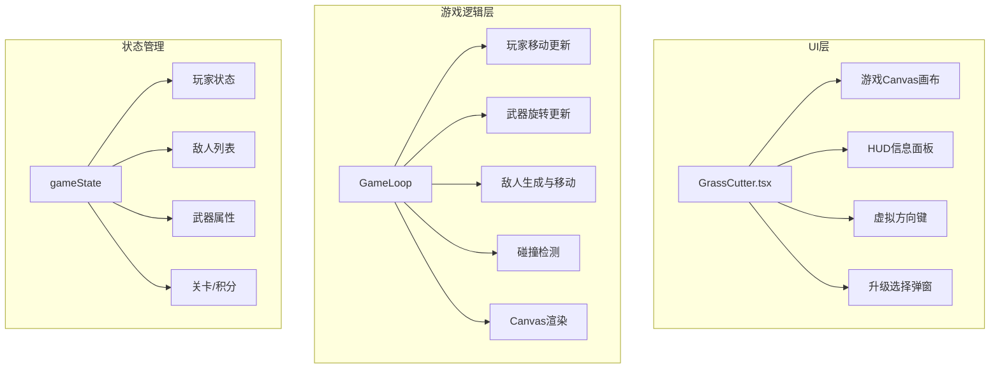
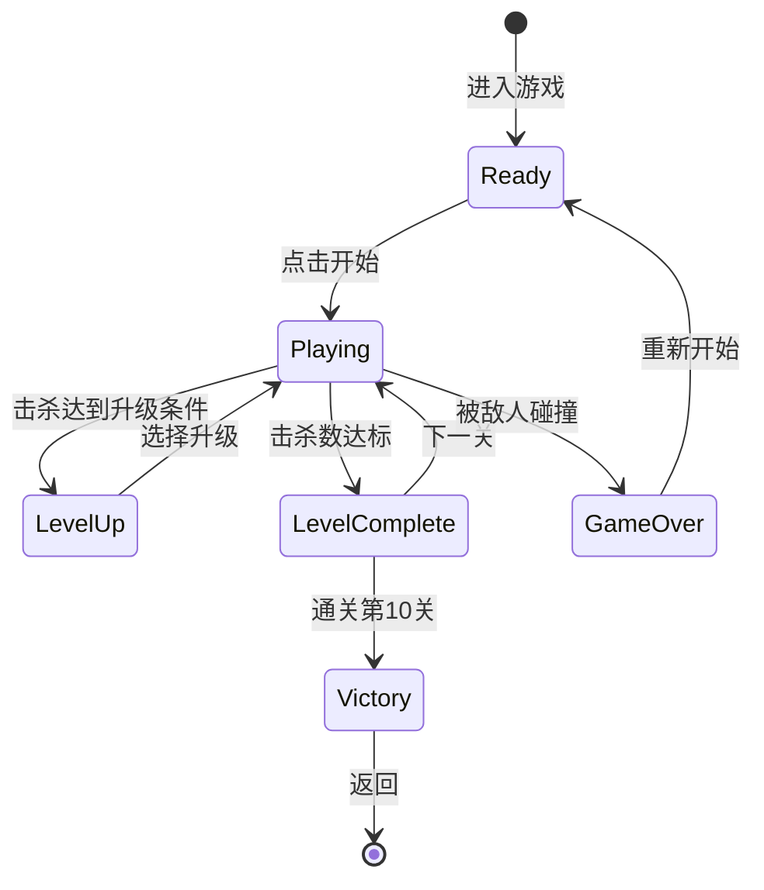

## 产品概述

一款休闲割草类动作游戏，玩家操控白色小球在场景中移动，使用自动旋转的武器击杀随机出现的黑色敌人小球，通过积分和关卡系统提供持续的游戏目标和成就感。

## 核心功能

1. **玩家控制系统**：白色小球作为玩家角色，左下角提供虚拟方向键，长按方向键实现八方向移动
2. **武器系统**：围绕白球自动旋转的武器，持续攻击范围内的敌人
3. **敌人生成机制**：黑色小球敌人从屏幕边缘随机位置生成，向玩家方向移动
4. **升级系统**：击杀一定数量敌人后触发升级选择，可提升武器攻击范围或攻击力
5. **积分系统**：每次击杀敌人获得积分，积分随关卡递增
6. **关卡系统**：共10个关卡，每关敌人血量递增，通关条件为击杀指定数量敌人
7. **游戏状态管理**：包含开始界面、游戏中、升级选择、关卡结算、游戏结束等状态

## 技术栈

- **前端框架**: React 18 + TypeScript
- **构建工具**: Vite
- **样式方案**: CSS Modules
- **路由**: react-router-dom (HashRouter)
- **状态管理**: React Hooks (useState, useRef, useCallback, useEffect)
- **游戏渲染**: Canvas API (requestAnimationFrame)

## 实现方案

### 技术选型说明

采用 Canvas API 而非 DOM 元素来渲染游戏画面，原因如下：

- 游戏需要高频率更新（60fps），Canvas 重绘性能优于大量 DOM 操作
- 碰撞检测、旋转武器等需要精确的坐标计算，Canvas 更适合
- 敌人数量可能较多（50+），Canvas 批量绘制更高效

### 核心架构



### 数据结构设计

```typescript
// 玩家状态
interface Player {
  x: number;
  y: number;
  radius: number;
  speed: number;
}

// 武器状态
interface Weapon {
  angle: number;        // 当前旋转角度
  rotationSpeed: number;// 旋转速度
  range: number;        // 攻击范围（武器长度）
  damage: number;       // 攻击力
  width: number;        // 武器宽度
}

// 敌人状态
interface Enemy {
  id: number;
  x: number;
  y: number;
  radius: number;
  hp: number;
  maxHp: number;
  speed: number;
}

// 关卡配置
interface LevelConfig {
  level: number;
  enemyHp: number;
  killTarget: number;   // 通关所需击杀数
  spawnInterval: number;// 敌人生成间隔(ms)
  scorePerKill: number; // 每次击杀得分
}
```

### 数值平衡设计

| 关卡 | 敌人血量 | 通关击杀数 | 生成间隔 | 单杀积分 |
| --- | --- | --- | --- | --- |
| 1 | 10 | 10 | 2000ms | 10 |
| 2 | 15 | 15 | 1800ms | 15 |
| 3 | 22 | 20 | 1600ms | 22 |
| 4 | 30 | 25 | 1500ms | 30 |
| 5 | 40 | 30 | 1400ms | 40 |
| 6 | 52 | 35 | 1300ms | 52 |
| 7 | 66 | 40 | 1200ms | 66 |
| 8 | 82 | 45 | 1100ms | 82 |
| 9 | 100 | 50 | 1000ms | 100 |
| 10 | 120 | 60 | 900ms | 150 |


**武器初始属性**：

- 初始伤害：5/帧（武器每帧对接触敌人造成伤害）
- 初始范围：80px
- 旋转速度：0.05弧度/帧

**升级选项**（每击杀10个敌人触发）：

- 攻击力+2
- 攻击范围+15px

## 实现要点

### 性能优化

1. **游戏循环**：使用 requestAnimationFrame 保证流畅的60fps
2. **碰撞检测**：圆形碰撞检测（距离公式），武器采用线段与圆的相交检测
3. **敌人管理**：使用数组存储，击杀后标记删除，在渲染循环中统一清理
4. **Canvas优化**：每帧清空画布重绘，避免状态累积

### 触控交互

1. **方向键实现**：监听 touchstart/touchmove/touchend 事件
2. **长按移动**：记录触摸点相对方向键中心的偏移，计算移动向量
3. **触摸区域**：方向键半径80px，提供舒适的触控体验

### 游戏状态机



## 目录结构

```
src/
├── App.tsx                    # [MODIFY] 添加GrassCutter路由
├── pages/
│   ├── GameCenter.tsx         # [MODIFY] 添加割草游戏入口卡片
│   ├── GrassCutter.tsx        # [NEW] 割草游戏主组件，包含游戏状态管理、Canvas渲染、游戏循环逻辑、升级选择UI、虚拟方向键组件
│   └── GrassCutter.module.css # [NEW] 游戏样式，包含Canvas容器、HUD面板、方向键、弹窗等样式定义
```

### 文件职责详述

**GrassCutter.tsx**：

- 游戏主逻辑组件，使用Canvas API渲染游戏画面
- 管理游戏状态（玩家、敌人列表、武器、积分、关卡）
- 实现游戏循环（requestAnimationFrame）
- 处理虚拟方向键的触摸事件
- 碰撞检测和伤害计算
- 敌人生成逻辑
- 升级选择弹窗交互

**GrassCutter.module.css**：

- 游戏容器全屏布局
- HUD信息面板（积分、关卡、击杀数）定位样式
- 虚拟方向键样式（圆形背景、方向指示器）
- 升级选择弹窗样式
- 游戏结束/胜利弹窗样式
- 响应式适配

## 设计风格

采用深色科幻风格，营造割草游戏的紧张刺激氛围。游戏画面以深蓝色为主背景，配合霓虹光效突出玩家和敌人。

## 页面设计

### 游戏主界面

- **Canvas游戏区域**：全屏显示，深色渐变背景，添加网格线增加空间感
- **玩家角色**：白色发光圆球，带有外发光效果，清晰辨识
- **旋转武器**：青色光剑效果，围绕玩家旋转，带拖尾光效
- **敌人**：深灰色圆球，上方显示红色血条，被攻击时闪烁
- **HUD面板**：右上角半透明面板，显示当前关卡、积分、击杀数/目标数
- **虚拟方向键**：左下角圆形控制器，半透明背景，中心小圆点指示方向

### 升级选择弹窗

- 半透明黑色遮罩覆盖游戏
- 中央卡片式弹窗，圆角设计
- 两个升级选项卡片并排，hover时发光效果
- 选项图标+文字说明清晰展示升级内容

### 关卡结算弹窗

- 显示当前关卡成绩、获得积分
- 「下一关」按钮，渐变色背景

### 游戏结束/胜利界面

- 大标题显示结果
- 总积分统计
- 「重新开始」/「返回首页」按钮