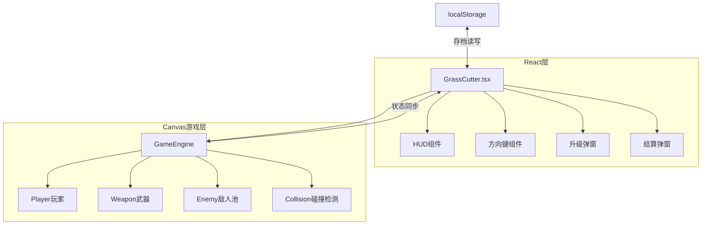

## 产品概述

在游戏中心新增一款「割草游戏」，玩家控制白色小球通过旋转武器消灭随机生成的黑色敌人球，具备完整的升级系统、积分系统和10关关卡机制，支持游戏进度保存。

## 核心功能

### 1. 玩家控制系统

- 玩家角色为白色小球，位于游戏区域中央
- 左下角虚拟方向键（摇杆），支持长按拖拽八方向移动
- 触控友好设计，支持移动端操作

### 2. 武器系统

- 围绕白球自动旋转的武器（光剑/刀片效果）
- 武器可升级：攻击范围、攻击力
- 武器与敌人碰撞自动造成伤害

### 3. 敌人生成系统

- 黑色小球敌人从屏幕边缘随机位置生成
- 敌人具有血条显示，被攻击时闪烁反馈
- 敌人向玩家方向移动，接触玩家造成伤害

### 4. 升级系统

- 击杀一定数量敌人后触发升级
- 升级时暂停游戏，弹出选择面板
- 可选升级项：武器范围、武器攻击力

### 5. 积分系统

- 击杀敌人获得积分
- 实时显示当前积分和击杀数

### 6. 关卡系统

- 共10关，每关有击杀目标数
- 关卡越高敌人血量越高、生成速度越快
- 通关后进入下一关，显示关卡结算

### 7. 存档系统

- 使用localStorage保存游戏进度
- 保存内容：当前关卡、角色等级、武器属性、最高分
- 下次打开自动恢复进度

### 8. 死亡与复活机制

- 玩家有生命值，被敌人碰撞会减少
- 死亡后回到当前关卡开头重新开始
- 保留已获得的武器升级

## 技术栈选择

- **前端框架**: React 18 + TypeScript（与现有项目一致）
- **构建工具**: Vite（与现有项目一致）
- **样式方案**: CSS Modules（与现有项目一致）
- **路由**: react-router-dom（与现有项目一致）
- **渲染技术**: Canvas 2D API（优先考虑兼容性和开发效率）
- **数据持久化**: localStorage

## 实现方案

### 核心设计思路

采用 Canvas 2D 实现游戏渲染，使用 requestAnimationFrame 驱动游戏循环。游戏逻辑与React状态分离，Canvas负责高频渲染，React负责UI层（HUD、弹窗等）。

### 关键技术决策

1. **渲染方案选择 Canvas 2D 而非 WebGL**

- 游戏复杂度较低（圆形绘制为主），Canvas 2D 足够满足性能需求
- 兼容性更好，无需处理WebGL fallback
- 开发效率高，代码简洁易维护

2. **游戏状态管理**

- 使用 useRef 存储游戏运行时数据（玩家位置、敌人列表等），避免React重渲染
- 使用 useState 管理UI相关状态（积分、关卡、弹窗显示等）
- 游戏循环通过 useEffect 控制生命周期

3. **触控方向键实现**

- 使用虚拟摇杆设计，支持任意方向移动
- 监听 touchstart/touchmove/touchend 事件
- 计算触摸点与摇杆中心的向量，归一化后作为移动方向

## 实现细节

### 性能优化

- 使用 requestAnimationFrame 替代 setInterval，确保60fps流畅渲染
- 敌人数组使用对象池复用，减少GC压力
- 碰撞检测使用圆形碰撞（距离计算），时间复杂度O(n)
- 只在必要时触发React状态更新（分数变化、关卡变化等）

### 游戏平衡数值设计

```
关卡1-10敌人血量: 30, 40, 55, 75, 100, 130, 170, 220, 280, 350
初始武器伤害: 10/tick
每次升级伤害增幅: +3
武器旋转速度: 3度/帧
敌人移动速度: 1.5-3.0 (随关卡递增)
生成间隔: 2000ms -> 800ms (随关卡递减)
```

### 存档数据结构

```typescript
interface GameSave {
  currentLevel: number      // 当前关卡 1-10
  highScore: number         // 最高分
  weaponDamage: number      // 武器伤害
  weaponRange: number       // 武器范围
  playerLevel: number       // 玩家等级
}
```

## 架构设计

### 系统架构图



### 模块划分

**UI层 (React)**

- `GrassCutter.tsx` - 主组件，管理游戏生命周期和UI状态
- `GrassCutter.module.css` - 样式文件

**游戏核心 (Canvas)**

- 玩家模块：位置、移动、血量、碰撞体
- 武器模块：旋转角度、范围、伤害、渲染
- 敌人模块：生成、移动、血量、受击、死亡
- 游戏循环：更新 -> 碰撞检测 -> 渲染

### 数据流

```
用户触摸方向键 -> 更新移动向量 -> 游戏循环更新玩家位置
敌人生成定时器 -> 添加敌人到列表
游戏循环 -> 武器与敌人碰撞检测 -> 扣血/击杀 -> 更新积分/触发升级
关卡完成 -> 显示结算 -> 进入下一关/保存进度
```

## 目录结构

```
src/
├── pages/
│   ├── GrassCutter.tsx          # [NEW] 割草游戏主组件
│   │   - 功能：Canvas初始化、游戏循环、UI状态管理
│   │   - 包含：玩家控制、武器系统、敌人系统、碰撞检测
│   │   - 包含：升级弹窗、结算弹窗、HUD显示
│   │   - 包含：localStorage存档读写
│   │
│   └── GrassCutter.module.css   # [NEW] 割草游戏样式文件
│       - 功能：游戏容器、HUD面板、虚拟摇杆、弹窗样式
│       - 保持与现有游戏一致的设计风格
│
├── App.tsx                      # [MODIFY] 添加割草游戏路由
│   - 修改：import GrassCutter组件
│   - 修改：添加 /grasscutter 路由
│
└── pages/
    └── GameCenter.tsx           # [MODIFY] 添加游戏入口卡片
        - 修改：games数组添加割草游戏配置
```

## 关键代码结构

### 游戏状态类型定义

```typescript
// 玩家状态
interface Player {
  x: number
  y: number
  radius: number
  hp: number
  maxHp: number
  speed: number
}

// 武器状态
interface Weapon {
  angle: number           // 当前旋转角度
  range: number           // 武器长度
  damage: number          // 每次伤害
  rotationSpeed: number   // 旋转速度(度/帧)
  width: number           // 武器宽度
}

// 敌人状态
interface Enemy {
  id: number
  x: number
  y: number
  radius: number
  hp: number
  maxHp: number
  speed: number
  hitFlash: number        // 受击闪烁计时
}

// 关卡配置
interface LevelConfig {
  level: number
  enemyHp: number
  enemySpeed: number
  spawnInterval: number
  killTarget: number
}

// 游戏存档
interface GameSave {
  currentLevel: number
  highScore: number
  weaponDamage: number
  weaponRange: number
  playerLevel: number
}
```

## 设计风格

采用现代游戏UI风格，深色主题背景配合霓虹发光效果，营造割草游戏的战斗氛围。整体设计保持与游戏中心一致的圆角卡片和渐变色彩语言。

## 页面设计

### 游戏主界面

- **游戏区域**：全屏Canvas，深色渐变背景（深蓝到深紫）
- **玩家角色**：白色发光圆球，带有柔和的外发光效果
- **旋转武器**：青色/蓝色光剑效果，带有拖尾和发光
- **敌人**：黑色圆球，顶部显示红色血条，受击时红色闪烁

### HUD信息面板（顶部）

- 半透明深色背景，圆角设计
- 左侧：当前关卡标识
- 中间：击杀数 / 目标数
- 右侧：当前积分

### 虚拟摇杆（左下角）

- 外圈：半透明白色圆环，直径120px
- 内圈：白色实心圆，直径50px
- 支持360度任意方向拖动
- 松手后内圈回弹到中心

### 暂停/返回按钮（右上角）

- 与现有游戏一致的白色圆形按钮

### 升级选择弹窗

- 全屏半透明黑色遮罩
- 居中白色圆角卡片
- 标题："选择升级"
- 两个选项卡片：范围提升 / 伤害提升
- 每个选项显示当前值和提升值

### 关卡结算弹窗

- 与升级弹窗类似的设计
- 显示：关卡完成、击杀数、获得积分
- 按钮：进入下一关

### 死亡弹窗

- 显示：Game Over、本次积分
- 按钮：重新挑战（从当前关卡开始）